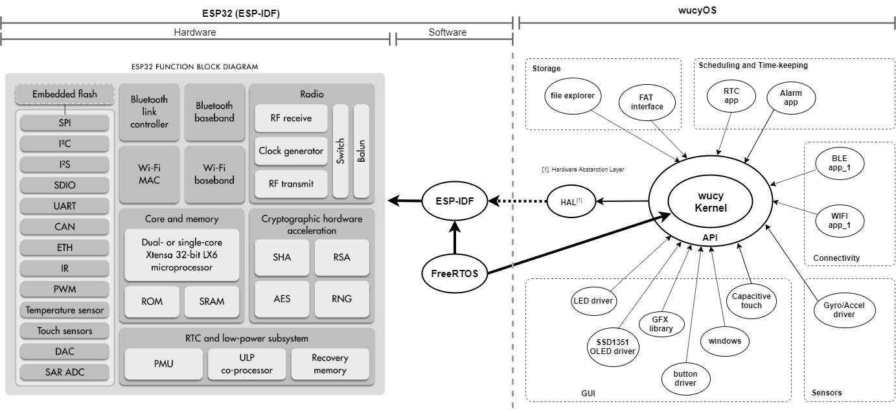

# W.U.C.Y.  

 **Wearable retro computer**  

`Quite a simple & hackable watch for nerds.`

### Vision

is to create retro watch-like open source wearable computer. Technically you could call this an open source smartwatch, but I don't like the word "smart", in fact - computers are dumb, they do only what's told as long as they're open. Lets keep it that way. I'd rather want wucy to be _honest_ than _smart_. My plan is to create hardware & software platform, spark a community, have fun and make something special. :)

Currently I am working on this alone, but I encourage you to join.  
I'm still learning how github works, I'm an amateur hacker, DM me if you think you can help. About the progress down at the bottom.

### Hardware

Initial loose idea for hardware.
_(Highest priority from top to bottom, bold is a must-have, ??? - yet usure of what chip to use)_

* **CORE - ESP32-PICO-D4** (very powerful System in Package: Xtensa® dual-core 32-bit LX6 microprocessors, up to 600 MIPS, integerated WiFi & BLE, 448 KB ROM, 520 KB SRAM, integrates 4 MB of external SPI flash, Quad-SPI supports multiple flash/SRAM chips).
* **Display - SSD1351** (128x128 18-bit color OLED). I think it fits perfectly for this application. Costs just above 10 $ on aliExpress.
* **Digital inputs - 4 ?.** Side scroll wheel (tri-state) and one additional tactile push button on contrary side (could be change).
* **Battery - 280 mAh Li-po (303030).** Found it quite cheap on ebay, it fits my CAD model really well, though it's energy density is around 380 Wh/L (according to specs sheet) while with current technology you could get almost double of that with a Li-Po - 730 Wh/L, more than 500 mAh at those dimensions. Might have to research more.
* **Storage - microSD flash** card slot for mass storage.
* **Connectivity - USB type C.** USB for for programming & Charging. (Maybe file access if possible ? I need to research that ?). Micro USB might also do, but i prioritize type C because it is becoming more convenient. Only drawbacks are cost and difficulty to hand-solder. 
* **Programming - CP2102**  USB to UART bridge (Espressif's recommendation).
* ??? **Power management** - battery management IC, 3.3V LDO.
* ??? **Real-time clock** - 32K Quartz(?)(todo: research RTC capabilities inside ESP32, my priority to use as little external parts as possible).
* ??? **Extra flash - better safe than sorry.** Will do if there will be enough space left. 
* ??? **Sensors** - Accelerometer and Gyroscope at least.

* ??? Indication - single color or RGB LED (depends on IO pins left on MCU).
* ??? Vibration - tiny motor (maybe on rev.2 if power consumption will be efficient).

If there will be a demand, I might consider making wucy's DIY kits or prebuild hardware making them plug&play, however that sounds like a devastating labour by hand... Thats a problem for future, if there will ever be one, lol.

### Software 
Custom kernel wrapped in FreeRTOS with neat GUI, easy access to system hardware IO, external file storage etc. I want great flexibility on power usage and computing performance. I want to make an API framework for easy application developement within the kernel and on top of the system. I want this wearable to be fast and efficient. Currently developing on ESP-IDF framework, I think ESP32 is a great SoC to start on, however I do think about portability, so I structure my code accordingly.  

Figure 1. Current plan for system structure. Modular operating system.

### Progress

* 2019-09-28 
Very much a work in progress. Nothing really works as a whole. I have written a bit of kernel and GUI framework - it is a year old project started on STM32, it already has working button driver, animated menu dropdown list, visual RTC, animated watch face, time editing, settings menu, fps indication, freeRTOS run time stats window. Currently that GUI is desinged around monochrome SSD1306 OLED display, so I will need to reconstruct and port that progress to my current ESP-IDF platform. Now I am working on SSD1351 driven OLED display which is bigger and full color. Already written a driver with windows support, early gfx library, both need a lot of tweaking and new features. Considering what display interface to use -serial or parallel. I really do want the display to run at 60 fps, but it seems it is impossible with SPI. Theoretically I can get up to around 50 fps, which might be good enough. I have to decide that to move on with the hardware. I already have crude Fusion360 model, case-less parts composition, board dimensions planned out, started designing PCB and selecting parts...

* 2019-10-01
Drawn a diagram of whone system structure (fig.1), restructuring code.

### Future ideas

Maybe create a bootloader that could enable loading precompiled applications such as game from SD card storage to RAM and run it within the OS. I have no skill on this, so contact me if you think you can help.

### License
All of my contribution will be under open hardware and open software licenses. I'm very new to licensing, however here's my current decision:

I want this project to be purely open-source, World is too corrupt already, and to me it feels important, so I decided to license my software under copy-left GPL-3.0 (at least for now). 

Hardware licensing will come into consideration later, currently I don't have any decent documentation to publish.

### Extra

Take everything with a grain of salt, I'm an inexperienced engineer, still a student. Honestly, I don't really know what I'm doing. I just have this idea in my mind and I want to make it somewhat real. I thinks it is cool.

Some of my inspirations: 
Zak Kemble's N|Watch; Pebble watch; 
Unexpected maker, Steve Wozniak, Linus Torvalds, Mohit Bhoite.

[More info in wiki](https://github.com/therram/thera/wiki).
