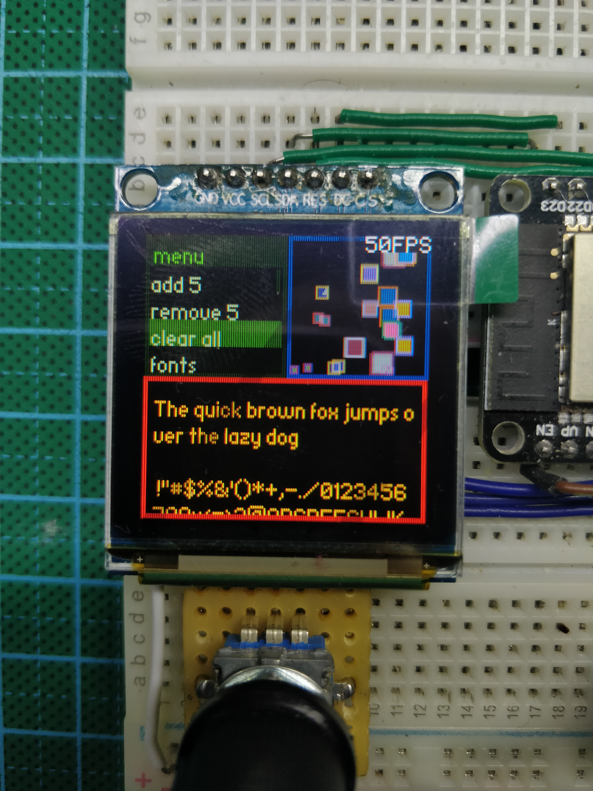

### Progress

* 2019-09-28 
Very much a work in progress. Nothing really works as a whole. I have written a bit of kernel and GUI framework - it is a year old project started on STM32, it already has working button driver, animated menu dropdown list, visual RTC, animated watch face, time editing, settings menu, fps indication, freeRTOS run time stats window. Currently that GUI is desinged around monochrome SSD1306 OLED display, so I will need to reconstruct and port that progress to my current ESP-IDF platform. Now I am working on SSD1351 driven OLED display which is bigger and full color. Already written a driver with windows support, early gfx library, both need a lot of tweaking and new features. Considering what display interface to use -serial or parallel. I really do want the display to run at 60 fps, but it seems it is impossible with SPI. Theoretically I can get up to around 50 fps, which might be good enough. I have to decide that to move on with the hardware. I already have crude Fusion360 model, case-less parts composition, board dimensions planned out, started designing PCB and selecting parts...

* 2019-10-01
Drawn a diagram of whole system structure (fig.1), restructuring code.

* 2019-10-15
Windows framework working - window managing, layering, rendering on screen. Needs optimization.

* 2019-10-22 Restructured operating system (see fig.1). Rewriting windows program from C to C++, combining with slightly modified AdaruitGFX library.

* 2019-11-12 Many overall software improvements, bug fixes, rewritten old option list from C to C++, very happy and surpirsed with the new simplicity thanks to highly doubted OOP. Cleaned and improved AdafruitGFX lib, added new fonts: converted some .ttf fonts with Adafruit's supplied converter tool. Choosen haxrcorp_4089 8pt as main OS font, for smaller prints trixel_square 4pt and for big glyphs - Maniac 16pt font.  I needed some visual animation for testing, so I written "BouncerBox" class, which draws window box on screen with randomized floating little squares inside.

* 2019-11-14 Created documentation folder, added some pictures (below).

